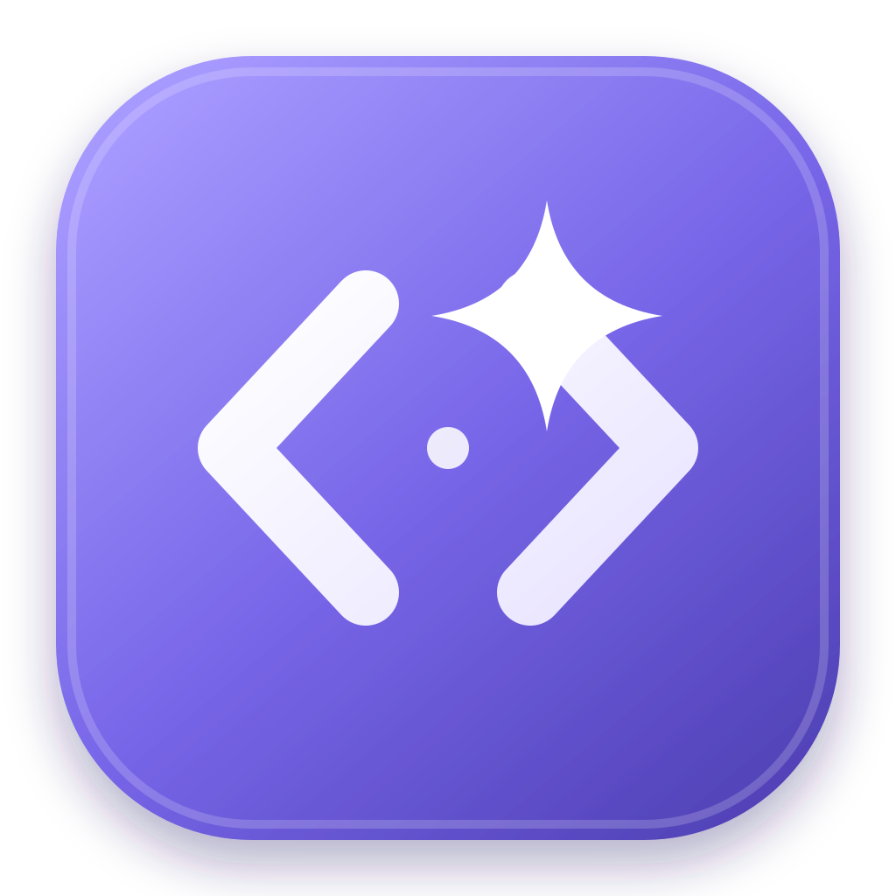
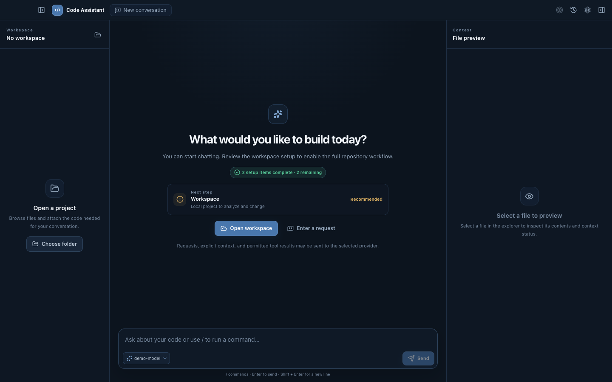

**English** | [한국어](README.ko.md)

<div align="center">
  

  # Code Assistant

  A local-first desktop workbench for exploring, changing, and validating software projects with configurable AI providers.

  [Getting started](#getting-started) · [Security model](#security-model) · [Architecture](docs/architecture.md) · [Contributing](CONTRIBUTING.md)
</div>



## Why this project exists

Code Assistant brings repository exploration, contextual chat, reviewed file changes, structured command execution, and long-running goals into one desktop application. Provider transport is isolated behind a canonical driver contract, while filesystem and process access stays in the Electron main process behind explicit trust and approval boundaries.

The result is a workbench that can adapt to different models and endpoints without embedding project-specific workflows in the application core.

## Highlights

- Configurable Responses API-compatible endpoints and runtime model discovery
- Streaming responses, tool activity, usage reporting, cancellation, and bounded retries
- Default-deny Workspace Trust before repository automation is enabled
- Lazy workspace explorer with explicit context selection and file preview
- Read-only Git status and diff through the system Git executable
- Revision-bound file proposals, deterministic diffs, approval policies, atomic replacement, rollback, recovery, and undo
- Shell-free structured process execution with bounded input, output, and time
- Repository instructions, slash commands, skills, hooks, and read-only subagent profiles
- Persistent conversations and workspace goals with plans, checkpoints, token budgets, and resumable runs
- Korean and English interface localization
- Optional protocol-compatible extension sources supplied through service configuration instead of vendor-specific paths in the runtime core

## Security model

The renderer cannot directly access the filesystem, child processes, or provider credentials. Privileged work crosses validated IPC contracts and is checked against the selected workspace, its trust state, and the current approval policy.

Important boundaries include:

- Workspace paths are canonicalized and constrained to the selected project.
- Sensitive files and credential-like content are blocked from normal reads and Git output.
- Existing-file changes are bound to a SHA-256 preimage and revalidated immediately before application.
- Commands use an executable plus exact argument vector with `shell: false` by default.
- API credentials use the platform credential backend when available; plaintext fallback is rejected.
- Provider requests use `store: false`, but the configured provider's own retention policy still applies.

This application is not an operating-system sandbox. An approved process runs with the same host permissions as the application. Use a container, virtual machine, or dedicated operating-system account when stronger isolation is required.

Read [Security and Workspace Trust](docs/security-and-trust.md), [Data and privacy](docs/data-and-privacy.md), and [SECURITY.md](SECURITY.md) before using the application with sensitive repositories.

## Getting started

### Requirements

- Node.js 24
- pnpm 11.7.0
- System Git
- macOS, Windows, or Linux for development; packaging requirements vary by platform

### Install and run

```bash
pnpm install --frozen-lockfile
pnpm dev
```

When the application opens:

1. Select a workspace.
2. Review and explicitly trust it if repository automation should be enabled.
3. Add a Responses API-compatible provider endpoint and credential in Settings.
4. Refresh the model list and select a model.
5. Start a conversation, attach explicit file context, or create a Goal for resumable work.

Provider URLs must use HTTPS. Loopback HTTP is accepted for local development servers. URL credentials, query strings, and fragments are rejected.

## Development commands

| Command | Purpose |
| --- | --- |
| `pnpm dev` | Start the Electron development application |
| `pnpm check` | Run lint, type checks, unit tests, and the production license audit |
| `pnpm test` | Run deterministic unit and security evaluation suites |
| `pnpm test:e2e` | Build and run the Electron end-to-end suite |
| `pnpm test:live:responses` | Run the opt-in live Responses protocol evaluation |
| `pnpm build` | Create the production renderer and main-process bundles |
| `pnpm package` | Build a platform-specific application directory |
| `pnpm license:check` | Verify that production dependencies declare recognized licenses |

Live evaluation credentials and endpoint details are passed only through process environment variables. See [Live provider evaluations](docs/live-provider-evals.md).

## Architecture at a glance

```text
Renderer
  │ validated IPC
  ▼
Electron main process
  ├─ Workspace Trust and approvals
  ├─ Canonical assistant driver registry
  ├─ Tool, skill, hook, and subagent registries
  ├─ File mutation journal and undo
  ├─ Structured process runner
  └─ Conversation and Goal stores
       │
       ├─ local filesystem and system Git
       └─ configured Responses API-compatible endpoint
```

The coordinator owns tool-loop semantics. Drivers translate canonical turns and events to a provider protocol while keeping replay state behind opaque session handles. This prevents provider-specific transport types from spreading through workspace, approval, and lifecycle services.

See [Architecture](docs/architecture.md) and [General-purpose assistant design](docs/general-purpose-assistant-design.md) for the detailed service boundaries.

## Extensions

- Add `*.command.md` files for workspace slash commands.
- Add workspace skills under `.agents/skills/<skill-name>/SKILL.md`.
- Add read-only subagent profiles under `.agents/agents/*.md`.
- Add structured hooks under `.assistant/hooks.json`.
- Connect optional stdio extensions through the settings interface.

Additional compatibility roots can be supplied as validated service configuration. They are not hard-coded into the orchestration layer.

See [Extensions](docs/extensions.md) for formats, trust requirements, resource limits, and revision behavior.

## Project status

The current release supports foreground bounded Goal runs and locally verifiable directory packaging. It does not yet provide a background scheduler, per-Goal worktrees, production notarization, or production Windows signing.

The local macOS credential broker is a development integrity boundary for consistently signed builds. It does not replace production signing, notarization, or host-level isolation. See [macOS signing](docs/macos-code-signing.md).

## Contributing

Bug reports and focused pull requests are welcome. Start with [CONTRIBUTING.md](CONTRIBUTING.md), run `pnpm check`, and include relevant tests for behavioral changes. Do not include credentials, private repository content, machine-specific paths, or generated application bundles.

## License

The project is available under the [MIT License](LICENSE). Production dependency licenses are checked with `pnpm license:check`; dependency packages remain subject to their respective license terms.
