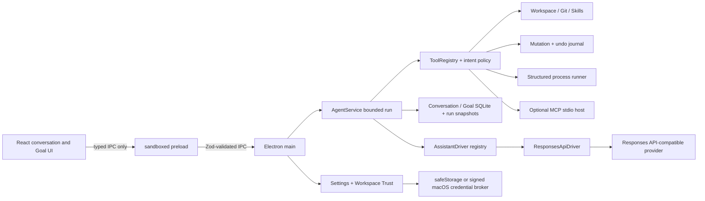

# 아키텍처

이 문서는 현재 구현의 서비스 경계를 설명합니다. 현재 사용자 대화와 수동 Goal run은 같은 `AgentService`, `AssistantDriver` registry, 도구 정책, 영속 run journal을 사용합니다. durable queue와 background 실행까지 포함한 목표 구조는 [범용 코드 어시스턴트 설계](general-purpose-assistant-design.md)를 참고하세요.

## 설계 목표

Code Assistant는 모델을 권한 주체로 취급하지 않습니다. 모델은 읽기, 변경, 실행을 **제안**하고, 애플리케이션의 결정론적 정책과 사용자가 실행 가능 여부를 결정합니다. 공급자·모델·저장소 콘텐츠는 동적으로 바뀔 수 있지만 containment, schema validation, trust gating, approval binding은 코드로 강제합니다.

렌더러에는 Node.js API나 `ipcRenderer` 객체를 그대로 노출하지 않습니다. preload는 필요한 메서드만 `contextBridge`로 공개하며, main은 현재 창의 main frame과 허용된 renderer URL인지 확인한 뒤 모든 payload를 다시 검증합니다.

## 서비스 경계

| 서비스 | 책임 | 주요 불변조건 |
| --- | --- | --- |
| `WorkspaceService` | 경로별 직계 자식 page, 파일 읽기, 텍스트 검색 | path-bound opaque cursor, 안정 정렬, empty·partial·error 구분, realpath containment, symlink 탈출·비밀·binary·크기 차단 |
| `TrustStore` | 워크스페이스 신뢰 결정 | 정규 경로 fingerprint, 기본 거부, versioned atomic 저장 |
| `InstructionService` | 저장소 지침 계층 구성 | 신뢰 후에만 읽기, root→context 순서, provenance와 byte limit |
| `CommandService` | `*.command.md` 발견·확장 | opaque ID, content revision, bounded template expansion |
| `SkillsService` | 저장소 Skill metadata/content/resource | 점진적 공개, revision 확인, 안전한 리소스 목록 |
| `AgentService` | foreground 대화·수동 Goal bounded run 조립 | trigger·intent·policy·Goal snapshot 고정, Goal frontier와 work/lifecycle 분리, 취소 전파, bounded tool loop |
| `AssistantDriverRegistry` | driver ID와 구현의 동적 등록·선택 | provider 분기 없는 조회, ID 검증, 중복 등록 거부 |
| `ResponsesApiDriver` | Responses API와 canonical turn/event/session 변환 | SDK 타입 격리, opaque session 소유권, `store: false`, 취소 전파 |
| `ToolRegistry` | 공급자 중립 도구 정의·검증·dispatch | strict schema, capability/risk/origin, intent·actor·context별 enable policy |
| `GitService` | status/diff | workspace 밖 canonical 실행 파일, repository process filter·lazy fetch 차단, 민감 path/content 필터, bounded output |
| `ApprovalBroker` | 사용자 승인 ticket | run 소유권, 만료, 일회성 resolution, 취소 전파 |
| `MutationService` | exact patch/전체 교체 diff 준비·파일 적용·복구·undo | unique non-overlapping hunk, preimage/action hash, write-ahead pending journal, 파일별 atomic replace, rollback |
| `StructuredProcessRunner` | argv 명령 실행 | `shell: false`, workspace cwd, scrubbed env, timeout/output/cancel |
| `ConversationRepository` | 대화·독립 Goal·계획·checkpoint·run·감사 이벤트 | versioned SQLite, WAL, revision-bound Goal 변경, run snapshot, 중단 run 복구 |
| `McpService` | 선택적 stdio MCP 발견·호출 | config/tool revision, bounded protocol, ToolRegistry 동적 등록, workspace spawn와 호출 승인 |
| `SettingsStore` | provider·model·theme·locale·실행 한도·승인 정책과 credential ciphertext 저장 | versioned schema, atomic replace, signed backend metadata 선택, marker/key ID/AAD/CAS 기반 이관, 평문 fallback 거부 |
| `MacCredentialBrokerClient` | 로컬 self-signed macOS package의 API key 암복호화 위임 | 고정 서명 artifact와 runtime digest/CDHash 확인, bounded binary protocol, direct parent·app signature·leaf certificate·key ID 확인, Keychain UI 금지 |

## 앱 셸과 표시 언어 경계

renderer의 기본 셸은 좌측 워크스페이스 탐색기, 중앙 대화, 우측 파일 미리보기로 구성됩니다. 탐색기는 시작 시 전체 트리를 재귀하지 않고 폴더를 펼칠 때 해당 경로의 직계 자식 page를 읽습니다. directory의 `hasChildren`, page의 `complete`·`nextCursor`, 경로별 `unloaded | loading | loaded | partial | error` 상태로 아직 읽지 않은 폴더와 실제 빈 폴더를 구분합니다. 루트 generation과 요청 ID가 늦게 도착한 과거 응답을 버리고, 파일 변경 뒤에는 펼친 경로를 유지해 다시 읽습니다. 좌·우 패널 토글은 동일한 titlebar에 항상 남아 `aria-controls`와 `aria-expanded`로 대상 패널과 상태를 노출합니다. 새 대화는 브랜드 옆의 고정 액션이며, 우측 상단은 Goals, 대화 기록, 설정, 파일 미리보기 토글로 제한합니다. 좁은 창에서도 React의 열림 상태와 CSS visibility가 서로 어긋나지 않게 같은 상태에서 grid와 접근성 속성을 함께 갱신합니다.

표시 언어 계약은 `ko | en`이고 기본값은 `ko`입니다. `SettingsStore` schema version 5가 locale을 영속화하며 version 1~4 설정에는 이관 시 기본 locale을 추가합니다. renderer의 locale catalog는 앱 소유 UI와 숫자·날짜 형식을 담당하고, main process의 typed host/service catalog는 내장/MCP 도구 wrapper, Zod issue code 기반 입력 검증, 파일·Git·명령·Skill·설정 오류, run 취소·제한시간·중단·적용 효과 요약, 시작 시 DB·파일 변경 복구 알림을 담당합니다. 각 run은 시작할 때 설정의 locale을 읽어 해당 실행의 host 메시지에 일관되게 사용합니다.

번역 경계는 데이터 소유권과 분리됩니다. 사용자 메시지, 모델 응답, 파일 내용과 경로, 검색어, 명령·변경 summary, 명령 출력, provider 원본 오류, provider·model·MCP server/tool 식별자는 번역하지 않습니다. host catalog는 이 동적 값을 번역된 wrapper에 원문 그대로 삽입하므로, locale 변경이 모델 문맥이나 워크스페이스 데이터를 변형하지 않습니다.

## 에이전트 실행 흐름

1. renderer가 대화와 메시지 식별자, trigger, `answer | plan | act` intent, 선택적인 `goalId`를 전달해 run을 시작합니다. main은 payload를 다시 검증하고 run owner를 현재 renderer frame에 묶습니다.
2. main은 driver·공급자·모델·현재 워크스페이스·trust를 확인합니다. 설정한 작업 실행 제한시간(기본 15분, 허용 범위 1~60분)을 run deadline으로 계산합니다. Goal run이면 Goal이 현재 workspace의 active 객체인지, 예산이 남았는지 검증하고 objective·현재 plan·최신 checkpoint를 snapshot으로 조립합니다. plan에서는 첫 `in_progress`, 없으면 첫 `pending` 항목을 현재 work frontier로 선택합니다.
3. user/assistant placeholder와 실행 journal을 SQLite에 먼저 기록합니다. run에는 Goal ID, trigger, intent, policy ID, attempt, usage, outcome summary가 영속 snapshot으로 남습니다.
4. 명시적 컨텍스트를 안전하게 읽고, 신뢰된 경우에만 저장소 instruction layer와 ToolRegistry 도구를 구성합니다. 승인된 config revision에서 발견한 MCP 도구도 `origin: mcp`로 이 registry에 동적 등록합니다.
5. 설정의 `driverId`로 `AssistantDriverRegistry`에서 driver를 선택합니다. 현재 등록되는 기본 구현은 `ResponsesApiDriver`이며 canonical session과 turn event를 `AgentService`에 반환합니다.
6. driver stream의 텍스트와 tool activity를 renderer와 로컬 DB에 증분 반영합니다. 모델이 도구를 호출하면 JSON을 strict Zod schema로 다시 검증하며, 공급자가 보낸 schema 적합성 주장을 신뢰하지 않습니다.
7. `answer`와 `plan` intent에는 read-only 도구만 노출합니다. `act`에서도 write/process와 MCP 도구는 trust와 exact approval을 통과해야 합니다. Goal work phase에서는 plan/checkpoint/finish mutation 도구를 모델 catalog에서 제외하고, objective와 현재 frontier를 사용한 host completion contract가 evidence-only 작업인지 관찰 가능한 effect가 필요한 작업인지 분류합니다.
8. effect가 필요한 frontier에서 설정된 work round 비율만큼 읽기만 반복하면 host가 현재 frontier 집중을 보정합니다. lifecycle 예약 경계까지 effect 시도나 구체적 실패가 없으면 필요한 effect 종류의 도구만 노출하는 마지막 recovery turn을 한 번 제공한 뒤 work phase를 닫습니다. 특정 프레임워크나 파일 수가 아니라 run의 동적 도구 예산과 실제 host receipt를 사용합니다.
9. host-managed lifecycle phase는 일반 work transcript와 분리한 session에서 `update_goal_plan`, `checkpoint_goal`, 조건을 만족한 `finish_goal` 중 정확히 하나만 강제합니다. 호출 객체의 `expectedRevision`은 provider turn 직전 Goal snapshot revision으로 host가 결합하고, 실행 직전 repository CAS가 그 snapshot이 여전히 최신인지 확인합니다. 일반/non-forced revision-bound mutation은 caller revision을 그대로 검증합니다.
10. 자동 완료는 최신 plan의 모든 항목 완료, 현재 run의 fresh checkpoint, checkpoint와 effect revision 정합성, 현재 work contract 충족, host-observed completion evidence와 미해결 effect failure 부재를 요구합니다. 조건이 부족하면 frontier를 pending 또는 in-progress로 유지하고 Goal을 active로 남깁니다. checkpoint나 모델의 완료 문장만으로는 완료하지 않습니다.
11. provider가 usage event를 확정할 때마다 run과 Goal token ledger를 같은 SQLite transaction에 누적합니다. 최종 assistant message·run terminal snapshot·Goal 완료 전이는 증거와 revision을 다시 확인한 뒤 하나의 transaction으로 확정하므로, 충돌 시 Goal은 active로 남고 run은 error가 됩니다.
12. 앱이 비정상 종료된 뒤 재시작하면 남아 있는 `running` run과 메시지를 `interrupted`로 복구하되 이미 기록된 usage는 보존합니다. 파일 적용 pending은 before-image로 되돌리고 undo pending은 before-image로 수렴시킨 뒤 undone 상태로 확정합니다. 정상 실행 중 yield·provider 오류·취소·제한시간 경계에서도 fresh checkpoint가 없으면 host가 관찰한 read/change/effect만으로 fallback checkpoint를 기록합니다.

동일 대화의 모델 history는 완료된 메시지를 사용하며, 예외적으로 감사 이벤트가 적용 효과를 확인한 `interrupted` assistant의 host 생성 요약도 포함합니다. 임의의 crash partial text나 확인되지 않은 중단 응답은 제외합니다. 영속 대화는 driver ID, provider ID와 generation, model ID, canonical workspace path에 묶입니다. 공급자의 driver, base URL 또는 credential material이 바뀌면 generation이 증가합니다. 기존 대화의 어느 identity 항목이라도 현재 run과 다르면 history를 재구성하거나 대화 소유권을 바꾸지 않고 run을 거부합니다. in-memory driver session도 같은 runtime identity가 일치할 때만 재사용합니다.

Goal은 workspace가 직접 소유하며 대화는 선택적인 생성 출처일 뿐입니다. 한 workspace에 여러 열린 Goal을 둘 수 있고 대화를 보관하거나 삭제해도 Goal은 유지됩니다. IPC 계약은 revision-bound objective·token budget 수정을 지원하고, 현재 UI는 Goal 생성·조회, 일시정지·재개·종료·명시 완료와 **지금 실행**을 제공합니다. 각 실행은 renderer가 시작하고 소유하는 foreground bounded run입니다.

활성 Goal을 pause·종료·편집할 때 renderer가 보낸 revision은 기존 run을 취소하기 전에 먼저 검증합니다. 취소 과정이 host fallback checkpoint를 만들면 그 checkpoint에 의해 증가한 settled revision을 다시 읽어 사용자가 요청한 상태 변경에만 rebase합니다. 취소 이후 다른 actor가 Goal을 변경하면 repository CAS가 이를 외부 race로 거부하므로, host가 만든 revision 증가를 사용자 충돌로 오인하지 않으면서 실제 동시 변경도 덮어쓰지 않습니다.

파일 변경은 승인 후 첫 파일을 건드리기 전에 private pending journal을 내구성 있게 기록합니다. 각 파일은 같은 디렉터리의 임시 파일에서 atomic rename으로 교체하고, 실행 중 오류가 나면 설치한 postimage가 그대로인지 다시 확인한 뒤 역순으로 롤백합니다. 성공 시 pending journal을 일반 undo journal로 전환합니다. undo도 첫 복원 전에 별도 pending marker를 동기화합니다. 롤백 대상이 알려진 이미지가 아니거나 롤백 자체가 실패하면 marker를 보존하고 자동 덮어쓰기를 중단합니다. 따라서 파일 하나의 교체는 원자적이지만 다중 파일 변경 전체가 단일 파일시스템 트랜잭션처럼 원자적이라고 보장하지는 않습니다.

## 도구 정책

도구는 이름만 등록하지 않고 다음 metadata와 함께 등록합니다.

- `capability`: `read`, `git`, `write`, `process`, `skill`, `network`, `goal`
- `risk`: `read-only`, `host-managed` 또는 `approval-required`
- `origin`: `builtin`, `workspace`, `mcp`
- `allowedIntents`, `allowedActors`, `isEnabled(context)`: 현재 intent, actor, trust와 Goal 조건에 따른 동적 gating
- strict JSON schema와 별도의 Zod runtime schema

이 분리는 공급자나 저장소가 새로운 도구를 발견하게 하더라도 호스트 정책이 자동으로 완화되지 않게 합니다. `answer`와 `plan`에서는 개별 도구가 intent annotation을 빠뜨려도 host가 capability와 risk를 다시 평가해 write, process, network를 중앙에서 거부합니다. 모델이 알 수 있는 도구 목록 자체도 현재 context에서 활성화된 항목으로 제한합니다.

## 동시성·취소

run마다 `AbortController`를 사용하며 renderer가 사라지거나 워크스페이스가 바뀌거나 사용자가 취소하면 승인 대기, provider stream과 driver cancel hook, Git, mutation, child process로 취소를 전파합니다. 같은 Goal에는 동시에 하나의 run만 허용하고, pause·종료 같은 상태 변경은 Goal reservation 안에서 기존 run의 driver 정리와 fallback checkpoint 기록까지 기다린 뒤 settled revision으로 적용합니다. 같은 Goal의 mutation lock은 성공·실패 뒤 항상 해제되며, 취소 뒤 외부 revision race는 fail closed합니다. 승인 resolution은 run을 시작한 renderer frame만 호출할 수 있습니다. 사용자가 1~60분 범위에서 정하는 run timeout과 출력·호출 횟수 제한은 무한 stream, 무한 tool loop, 과도한 child output을 막는 로컬 안전 한도입니다.

## 현재 실행 경계와 후속 범위

현재 영속화되는 run snapshot은 완료된 대화와 Goal의 실행 이력을 복원하기 위한 기록이며, 아직 durable request queue나 재실행 가능한 event log는 아닙니다. renderer가 사라지면 run을 취소하고, Goal을 시간표나 외부 이벤트로 자동 wake-up하지 않습니다.

다음 항목은 현재 구현에 포함되지 않습니다.

- main 소유 durable queue, lease, background scheduler와 다중 run 실행 센터
- 재접속 후에도 유지되는 영속 approval과 Goal 범위 scoped grant
- Goal별 Git worktree/container 실행 backend와 검증된 patch 반입
- `ResponsesApiDriver` 외의 추가 protocol driver와 contract suite
- MCP resource/prompt, Hook lifecycle bus, 실제 subagent coordinator 통합

## 패키징 경계

프로덕션 renderer는 `app://renderer/` 전용 프로토콜에서 로드합니다. `contextIsolation`, renderer sandbox, CSP, Electron fuse를 적용합니다. macOS packaging은 unsigned/ad-hoc 결과를 거부하고 외부 CSC 또는 로컬 self-signed identity로 서명하며, 로컬 identity에는 재빌드와 독립된 고정 서명 credential broker를 포함합니다. 이 개발 서명과 broker는 같은 OS 사용자 권한의 process를 격리하는 sandbox가 아니며 Apple Developer ID, notarization, Hardened Runtime/App Sandbox 정책이나 Windows code signing을 대신하지 않습니다. 자세한 설정과 검증 범위는 [macOS 코드 서명 문서](macos-code-signing.md), 남는 위협은 [보안과 Workspace Trust](security-and-trust.md)를 참고하세요.
