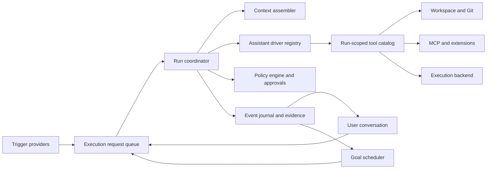

# 범용 코드 어시스턴트 설계

## 문서 상태와 범위

이 문서는 Code Assistant를 특정 업무 자동화 도구가 아니라, 사용자 요청과 지속 Goal을 같은 실행 코어에서 처리하는 범용 코드 어시스턴트로 발전시키기 위한 목표 설계와 현재 구현 상태를 함께 기록한다.

SR 조회·완료 처리는 MCP가 제공할 수 있는 하나의 시나리오일 뿐이다. 코어는 SR, 이슈, 티켓 같은 업무 객체를 알지 않으며, 실행 시점에 발견한 도구와 사용자 목표를 바탕으로 동작한다.

현재의 trust, containment, strict schema, exact approval, mutation journal, 취소 전파 경계는 유지한다. 범용화는 이 경계를 완화하는 작업이 아니라, 여러 실행 주체와 진입점을 동일한 경계 안에 배치하는 작업이다.

## 제품 정의

목표 Code Assistant는 다음 네 역할을 담당하는 로컬 실행 제어면이다.

1. 사용자 대화, Goal wake-up, 향후 외부 이벤트를 범용 실행 요청으로 수용한다.
2. 서로 다른 protocol driver를 공통 계약 뒤에서 실행한다.
3. 워크스페이스, Git, 프로세스, MCP, Skill, Hook 같은 기능을 동적 capability로 제공한다.
4. 모든 부수 효과를 정책·승인·검증·감사 경계 안에서 처리한다.

다음은 코어의 책임이 아니다.

- SR 전용 상태나 처리 순서를 코어 모델에 추가하는 것
- 하나의 공급자 API 형식을 범용 assistant 계약으로 간주하는 것
- 장시간 작업을 하나의 모델 응답이나 하나의 프로세스에 계속 붙잡아 두는 것
- 모델, Hook, MCP 서버가 스스로 권한을 확대하도록 허용하는 것
- 모델의 완료 선언만으로 Goal 또는 외부 업무가 완료됐다고 판정하는 것

## 현재 구현과 목표 구조의 차이

| 영역 | 현재 구현 | 목표 설계 |
| --- | --- | --- |
| 실행 진입점 | renderer가 사용자 대화와 **지금 실행** Goal을 foreground `AgentService` run으로 시작 | 모든 진입점이 영속 `ExecutionRequest`를 만들고 main 소유 `RunCoordinator`가 claim·실행 |
| 실행 구분 | trigger, `answer \| plan \| act` intent, policy ID, 선택적 Goal ID를 분리해 run snapshot에 기록 | 동적으로 등록되는 trigger·intent·policy descriptor와 외부 event dedupe |
| 도구 정책 | `answer`와 `plan`은 read-only, `act`만 trust·approval 경계 안에서 부수 효과 도구를 노출 | principal·effect·revision·grant를 함께 평가하는 `PolicyEngine` |
| Goal | workspace 소유 독립 객체, 복수 열린 Goal, plan/checkpoint/budget, IPC/UI와 수동 bounded run 연결 | schedule/retry wake-up, verifier evidence, 여러 budget ledger와 durable lifecycle |
| run 영속성 | Goal ID·trigger·intent·policy·attempt·usage·outcome을 conversation run journal에 snapshot | request queue, lease, 순번 event, approval, evidence와 재시작 가능한 attempt |
| 공급자 | canonical `AssistantDriver` 계약과 동적 registry, 기본 `ResponsesApiDriver` | assistant profile·capability negotiation과 추가 provider driver |
| MCP | stdio tool을 run 중 발견해 canonical ToolRegistry에 등록·호출 | tool/resource/prompt를 제공하는 run-scoped capability source |
| 승인 | renderer 소유 foreground run의 exact one-shot approval | 일회성 승인과 Goal 범위 scoped grant를 모두 평가하는 영속 정책 엔진 |
| 백그라운드 실행 | renderer가 사라지면 run 취소하며 자동 Goal wake-up은 없음 | main 소유 durable queue, background scheduler, 재접속 가능한 event cursor와 승인함 |
| 워크스페이스 | Goal에 canonical workspace path를 저장하고 수동 run 때 현재 workspace·trust를 재검증 | revision이 고정된 workspace binding, lease와 worktree/container backend |
| UI | 독립 Goal 목록·상세·생성·pause/resume/clear/complete/**지금 실행** | objective·policy 편집, 다중 run 실행 센터, 영속 승인함, 연결·evidence 상세 화면 |
| 서브에이전트·Hook | 발견·저장 서비스와 단위 테스트만 존재 | coordinator와 lifecycle event bus에 연결 |
| 완료 판정 | Goal 도구 자동 완료에 최신 완료 plan, 현재 run checkpoint, checkpoint 이후 부수효과 없음이 필요하고 run terminal과 원자 확정하며 사용자 명시 완료도 지원 | acceptance criteria, verifier와 구조화 evidence를 사용하는 명시적 전이 |

현재 구현은 실행 축 분리와 수동 Goal 세로 연결까지 완료했다. 다만 run snapshot은 과거 실행을 복원하는 기록이지 durable 실행 요청이나 재개 가능한 event log가 아니다. `RunCoordinator`, background scheduler, scoped grant, worktree backend와 두 번째 driver는 다음 단계다.

## 핵심 도메인 모델



### Trigger

Trigger는 run이 시작된 이유다. 현재 run 계약과 snapshot은 `providerId`, `type`, `dedupeKey`를 고정 enum이 아닌 검증된 문자열로 받으며 사용자 메시지와 수동 Goal 계속 실행의 출처를 보존한다. 아직 trigger provider registry, 영속 envelope와 dedupe claim은 없다.

목표 구조에서 trigger 종류는 닫힌 업무 enum으로 만들지 않고 provider registry에서 발견한다. 내장 provider로 사용자 메시지와 Goal wake-up을 제공하고, 향후 connector가 임의의 외부 이벤트 provider를 등록할 수 있다.

```ts
interface TriggerEnvelope {
  id: string
  providerId: string
  type: string
  dedupeKey: string
  payloadReference: string | null
  receivedAt: number
}
```

외부 payload는 사용자 지시문으로 위장하지 않고 출처가 표시된 untrusted data로 보관한다. `(providerId, dedupeKey)`는 유일해야 하며, 같은 이벤트가 여러 번 도착해도 하나의 요청만 생성한다.

MCP는 기본적으로 trigger가 아니라 capability source다. 예를 들어 주기적인 SR 조회는 Goal scheduler가 run을 깨우고 assistant가 동적으로 발견한 MCP 조회 도구를 호출하는 방식으로 구성한다. push 수신이 필요해지는 시점에만 별도의 범용 trigger provider를 추가한다.

### Conversation

Conversation은 사용자와 assistant가 협업하는 표시·문맥 컨테이너다. 실행 큐나 Goal 수명주기의 소유자가 아니다. 한 대화에서 Goal을 만들거나 계속할 수 있지만, Goal은 대화를 닫거나 UI workspace를 바꿔도 독립적으로 유지된다.

### Goal

Goal은 여러 bounded run에 걸쳐 달성할 지속 목표다. `goal`은 run mode가 아니며, 하나의 run이 Goal과 연결됐는지는 `goalId` 관계로 표현한다.

목표 구조의 Goal은 최소한 다음 정보를 가진다. 현재 구현은 objective/revision, canonical workspace path, 선택적 origin conversation, plan revision, checkpoint, token budget과 상태 전이를 제공한다.

- 자연어 objective와 revision
- assistant profile, workspace binding, execution policy 참조
- 현재 계획 revision과 마지막 checkpoint
- 동적으로 정의된 completion criteria와 verifier 선택
- token, run, wall-clock, tool-call 또는 비용 budget ledger
- trigger binding, 다음 wake-up, retry/backoff 상태
- active, paused, blocked, completed, cleared 상태와 전이 근거

`active` 상태에서 `nextWakeAt`이 미래이면 기다리는 중이다. 별도의 모호한 running 상태로 장기 대기를 표현하지 않는다. `blocked`는 사용자 입력, 권한, 외부 상태 변화 없이는 진행할 수 없을 때만 사용한다.

현재 DB는 Conversation과 Goal을 느슨하게 연결한다. Goal은 workspace가 직접 소유하고 origin conversation은 선택적이며, workspace마다 여러 Goal을 독립적으로 유지할 수 있다. 대화를 보관하거나 삭제해도 Goal은 남는다. 아직 Goal별 assistant profile, schedule/retry binding, verifier, run·시간·비용 budget은 구현되지 않았다.

### ExecutionRequest와 ExecutionRun

목표 구조에서 `ExecutionRequest`는 무엇을 왜 실행할지를 나타내는 영속 명령이고, `ExecutionRun`은 그 요청의 한 번의 bounded attempt다.

```ts
interface ExecutionRequest {
  id: string
  triggerId: string
  conversationId: string | null
  goalId: string | null
  parentRunId: string | null
  workspaceBindingId: string | null
  assistantProfileId: string
  intentId: string
  executionPolicyId: string
  instruction: string
  contextReferences: string[]
  idempotencyKey: string
  createdAt: number
}

interface ExecutionRun {
  id: string
  requestId: string
  attempt: number
  status: string
  providerSnapshot: unknown
  workspaceSnapshot: unknown
  capabilitySnapshot: unknown
  policySnapshot: unknown
  usage: unknown
  outcomeSummary: string | null
  startedAt: number | null
  finishedAt: number | null
}
```

상태 문자열은 runtime schema와 상태 전이 테이블로 검증한다. 최소 수명주기는 queued, preparing, running, awaiting approval, waiting input, terminal 상태를 구분해야 한다. renderer가 새로고침돼도 request, run, event, approval 상태는 사라지지 않는다.

현재는 별도 `ExecutionRequest` queue 없이 renderer가 bounded run을 시작한다. 대신 각 run에 Goal ID, trigger, intent, policy ID, attempt, usage와 outcome summary를 영속화해 대화 상세와 Goal 진행 상태를 복원한다. 이 snapshot을 durable queue나 event replay가 구현된 것으로 간주하지 않는다.

### Intent와 execution policy

기존 `interactive | plan | goal`은 서로 다른 축을 섞었다.

- Goal은 지속 객체와 trigger 관계다.
- 계획 작성은 실행 의도다.
- 쓰기 금지는 execution policy다.

현재 public run 계약은 trigger, `answer | plan | act` intent와 선택적 `goalId`를 분리한다. ToolRegistry는 `allowedIntents`를 평가하고 `answer`·`plan`에서는 write, process, network 도구를 노출하지 않는다. `act`도 workspace trust와 exact approval을 우회하지 않는다. legacy mode는 호환성을 위해 남아 있지만 새 Goal UI는 `goalId`와 trigger를 명시해 실행한다.

현재 Goal run은 objective와 plan의 첫 `in_progress` 또는 `pending` 항목을 work frontier로 선택하고, 별도 host classifier가 그 frontier가 evidence-only인지 workspace/process/MCP effect를 요구하는지 판정한다. effect가 필요한데 read-only 조사가 설정된 work budget 비율을 소진하면 frontier 집중 보정을 주입하고, lifecycle 직전에는 필요한 effect 종류만 노출하는 recovery turn을 한 번 제공한다. 이 bounded 보정은 현재 run 안의 no-op 반복을 막는 계약이며, 여러 policy profile을 단계별로 교체하는 완전한 coordinator는 아니다. 다음 단계에서는 intent descriptor와 policy profile을 registry에서 해석하고 security effect class에 따라 host가 최종 허용 범위를 결정해야 한다.

### Evidence와 checkpoint

Evidence는 모델의 설명이 아니라 서비스가 관찰한 구조화 결과다.

- 읽은 파일의 path, hash, revision
- 적용된 change set의 action hash와 변경 path
- 명령의 argv, exit status, 제한·취소 여부
- 테스트·빌드 verifier 결과
- MCP 외부 작업의 idempotency key와 operation receipt
- 사용자 승인 또는 정책 grant의 revision

현재 Goal checkpoint는 revision, run ID, 상태, summary와 누적 token 사용량을 기록하며 다음 수동 run에는 현재 plan과 최신 checkpoint 하나만 포함한다. 정상 yield와 provider 오류·취소·timeout에 fresh checkpoint가 없으면 host가 직접 관찰한 read path, changed path, 적용·실패 effect 종류로 fallback checkpoint를 기록한다. 자유 텍스트 summary는 완료 증거가 아니며 민감한 tool output이나 provider 오류를 그대로 복제하지 않는다.

Goal 자동 완료는 모든 plan 항목 완료, 현재 run의 fresh checkpoint, checkpoint와 effect revision 정합성, 현재 work contract 충족, host-observed completion evidence와 미해결 effect failure 부재를 함께 요구한다. 다음 단계의 구조화 Evidence는 파일·명령·MCP receipt 같은 원본 관찰을 checkpoint와 분리해 참조하도록 확장한다. LLM이 checkpoint summary를 작성할 수는 있지만, 원본 evidence와 상태 revision은 host가 기록한다.

## Assistant runtime 추상화

### Provider와 assistant driver 분리

base URL, credential, model 목록은 provider 연결 정보다. tool loop, event streaming, resume, native subagent 같은 실행 의미는 assistant driver의 책임이다. 둘을 하나의 단일 provider 구현으로 묶으면 다른 assistant를 추가할 때 orchestration 전체를 다시 작성하게 된다.

```ts
interface AssistantDriver {
  readonly id: string
  inspect(profile: unknown): Promise<DriverCapabilities>
  listModels(profile: unknown): Promise<ModelDescriptor[]>
  createSession(history?: CanonicalSessionHistory): AssistantDriverSession
  appendUserMessage(session: AssistantDriverSession, content: string): AssistantDriverSession
  appendToolResults(
    session: AssistantDriverSession,
    results: readonly CanonicalToolResult[],
  ): AssistantDriverSession
  compactSession(session: AssistantDriverSession, maxCharacters?: number): AssistantDriverSession
  runTurn(
    request: CanonicalRunTurnRequest,
    listener?: CanonicalDriverEventListener,
  ): Promise<CanonicalTurnResult>
  cancel?(runId: string): Promise<void>
}
```

이 계약과 `AssistantDriverRegistry`는 구현돼 있으며 설정의 `driverId`로 runtime 구현을 선택한다. 첫 번째이자 현재 기본 제공 driver는 기존 동작을 보존하는 `ResponsesApiDriver`다. protocol client 타입과 provider session state는 이 구현 내부에 격리되고, registry는 동적으로 driver를 등록·해제·조회한다.

추가 driver도 같은 canonical contract suite를 통과해야 하며 driver별 분기는 registry와 설정 schema 안에 머물고 향후 `RunCoordinator`에는 들어가지 않는다.

canonical event는 text delta, tool request, usage, checkpoint, completion, failure를 표현하며 provider SDK 타입을 shared contract나 ToolRegistry에 노출하지 않는다. opaque session handle은 발급한 driver만 해석할 수 있다. driver capability는 tool calling, streaming, resume token, reasoning, context limit 같은 확장 가능한 feature ID와 limit으로 런타임에 협상한다.

외부 assistant가 자체 파일·프로세스 도구를 직접 실행하는 경우 두 방식만 허용한다.

1. host capability bridge를 사용해 기존 정책과 승인을 통과한다.
2. 격리된 worktree/container에서 실행하고 결과 patch와 evidence를 host 변경 파이프라인으로 가져온다.

활성 workspace를 host 권한으로 직접 수정하는 delegated process는 기존 보안 불변조건과 양립하지 않는다.

### Assistant profile

Assistant profile은 후속 단계에서 driver, provider credential reference, 모델 선택 규칙, 기본 intent/policy, context strategy를 묶을 사용자 구성이다. 현재는 provider 설정에 `driverId`를 저장하고 Conversation identity와 run snapshot으로 실제 선택 경계를 보존한다. 목표 구조에서는 Goal과 Conversation이 raw provider ID 대신 profile을 참조하고 각 run이 실제 선택 결과를 snapshot으로 남긴다. 모델 ID나 공급자 URL 변경을 조용히 기존 대화에 적용하지 않고 명시적인 runtime boundary 또는 fork로 표시한다.

## ToolCatalog와 MCP

현재 `ToolRegistry`는 provider 중립 `CanonicalToolDefinition`과 별도 Zod validator를 사용하므로 protocol SDK의 도구 타입과 분리돼 있다. capability, risk, origin, allowed intent/actor와 동적 `isEnabled` 조건으로 모델에 공개할 도구와 실행 가능 여부를 제한한다. Goal이 연결된 trusted `act` run에서는 Goal 조회와 lifecycle 도구도 registry에 조건부 등록하지만, 일반 work phase의 provider catalog에서는 plan/checkpoint/finish mutation을 제외한다. work phase가 닫힌 뒤 host가 clean session에서 lifecycle 도구 하나만 선택해 강제하므로 모델이 조사와 상태 변경을 임의로 섞지 못한다.

목표 ToolCatalog descriptor는 현재 계약을 다음 속성까지 확장한다.

- namespaced stable ID와 source ID
- discovery revision과 configuration revision
- JSON Schema와 별도 runtime validator
- read, write, process, network, destructive 같은 host security effect 집합
- main/subagent principal과 execution policy별 availability
- 입력 preview와 실행 후 evidence mapper

비즈니스 capability 이름과 schema는 동적으로 발견한다. 반면 security effect class와 default-deny 전이는 host가 결정론적으로 해석한다. MCP annotation은 display hint일 뿐 권한의 근거가 아니다.

목표 구조의 ToolCatalog는 run 시작 시 immutable snapshot으로 고정한다. 실행 중 MCP schema나 config revision이 바뀌면 기존 호출을 거부하고 다음 attempt에서 재발견한다. MCP session은 run/workspace 단위로 수명과 ownership을 분명히 하며, 한 run의 discovery가 다른 run의 catalog를 변경하지 않게 한다.

장기적으로 MCP tools뿐 아니라 resources와 prompts도 각각 context source와 prompt asset으로 노출한다. transport, 인증 방식, 서버 종류는 MCP adapter가 담당하며 코어에는 stdio나 특정 업무 서버 분기를 추가하지 않는다.

## 목표 RunCoordinator 실행 흐름

현재 `AgentService`는 아래 흐름 가운데 foreground bounded driver/tool loop, Goal context, usage와 outcome snapshot까지 담당한다. durable request 생성·claim, lease, 순번 event, scheduler 갱신은 아직 구현되지 않았다.

1. trigger provider가 dedupe key를 포함한 envelope를 저장한다.
2. request factory가 Conversation, Goal 또는 connector 입력을 하나의 `ExecutionRequest`로 정규화한다.
3. coordinator가 request를 claim하고 attempt lease를 획득한다.
4. workspace, trust, assistant profile, provider, capability, policy revision을 snapshot으로 고정한다.
5. context assembler가 사용자 입력, Goal objective·plan·checkpoint, 관련 evidence, repository instruction과 필요한 Skill만 예산 안에서 조립한다.
6. driver가 canonical event를 내보내고 tool request는 ToolCatalog와 PolicyEngine을 통과한다.
7. tool 결과와 usage를 append-only event/evidence로 저장한 뒤 driver에 반환한다.
8. run을 terminal 상태로 확정하고 Goal progress, budget ledger, checkpoint를 하나의 트랜잭션으로 갱신한다.
9. Goal이 계속 active라면 scheduler가 다음 wake-up을 계산한다. 권한이나 사용자 입력이 필요하면 blocked 또는 awaiting approval 상태로 전이한다.

각 attempt는 시간·토큰·도구 호출 한도가 있는 bounded run이다. “계속 조회”는 하나의 무한 tool loop가 아니라 `wake-up → bounded run → checkpoint → next wake-up`의 반복으로 구현한다.

## 목표 GoalScheduler

GoalScheduler는 아직 구현되지 않았다. 현재 Goal은 사용자가 UI에서 **지금 실행**을 선택할 때만 foreground bounded run으로 계속된다. 목표 초기 scheduler는 Electron main process가 실행 중일 때 동작한다. 앱이 종료된 동안의 wake-up은 재시작 시 catch-up하되 같은 Goal에 대해 한 번만 claim한다. OS 로그인 서비스나 별도 daemon은 운영 요구가 생겼을 때 execution host로 분리한다.

필수 불변조건은 다음과 같다.

- Goal마다 동시에 하나의 active attempt만 허용한다.
- claim은 lease와 heartbeat를 사용하고 재시작 시 만료 lease를 회수한다.
- wake-up과 외부 이벤트에는 unique idempotency key가 있다.
- 재시도는 error classification, 제한된 횟수, exponential backoff와 jitter를 사용한다.
- sleep 이후 밀린 interval을 횟수만큼 몰아서 실행하지 않고 최신 상태로 한 번 실행한다.
- workspace, provider, MCP server별 concurrency와 부수 효과 lock을 분리한다.
- budget을 초과하면 모델을 다시 호출하지 않고 host가 Goal을 정지한다.

## 승인과 자율 실행 정책

현재 구현은 renderer 소유 foreground run의 exact one-shot approval과, 신뢰한 canonical workspace에 결합된 1차 bounded 승인 정책을 함께 사용한다. 파일 정책은 작업·경로 prefix·파일/줄/diff byte 한도와 Goal 전용 범위를, 명령 정책은 canonical executable·argv prefix·cwd·timeout·host network와 Goal 전용 범위를 평가해 자동 승인 또는 수동 승인 전환을 결정한다. MCP는 계속 exact one-shot approval만 허용한다.

- principal: 사용자, Goal, main agent, subagent
- workspace와 trust revision
- assistant profile과 policy revision
- capability source, tool revision, security effects
- 입력 preview, 대상 path, 외부 endpoint
- 남은 budget과 grant 사용 횟수

현재 정책은 workspace 단위의 정적 bounded grant이며 Goal 전용/모든 act 실행 범위를 선택할 수 있다. 아직 특정 Goal ID, 만료, 최대 사용 횟수, server/tool revision에 결합된 durable grant와 백그라운드 승인함은 구현되지 않았다. 후속 grant는 Goal, workspace fingerprint, server/tool identity와 revision, 허용되는 인수 제약, 만료, 최대 호출 수, 취소 가능성을 포함해야 한다. 모델이나 MCP 서버는 정책이나 grant를 생성·확장할 수 없다.

안전한 인수 범위를 구조적으로 표현할 수 없는 write/process/network action은 승인함에서 대기한다. renderer가 사라져도 approval record를 보존하고, 사용자가 승인하면 snapshot을 재검증한 새 attempt 또는 안전한 resume 지점에서 계속한다.

서브에이전트와 Hook은 부모 권한의 부분집합만 가진다. Hook은 context 추가나 차단은 할 수 있어도 allow/deny 정책을 완화하거나 approval grant를 만들 수 없다.

## 외부 부수 효과와 완료 판정

외부 상태를 변경하는 MCP 호출은 응답 유실 시 성공 여부가 불명확할 수 있다. 가능한 도구에는 request idempotency key를 전달하고 operation receipt를 evidence로 저장한다. timeout 뒤에는 무조건 재호출하지 않고 조회/reconciliation capability가 있으면 먼저 실제 상태를 확인한다.

현재 forced Goal lifecycle turn은 provider 호출 직전 읽은 Goal snapshot revision을 해당 lifecycle call의 `expectedRevision`에 host가 결합한다. 모델이 다른 숫자를 생성해도 host snapshot으로 교체하지만 repository 실행 전 CAS는 유지하므로, provider turn 사이에 실제 Goal이 바뀌면 stale 호출이 거부된다. 이 binding은 host가 격리해 강제한 lifecycle transition에만 적용하며 일반 revision-bound mutation의 caller revision을 조용히 고치지 않는다.

현재 자동 `finish_goal`은 위 revision-bound 변경과 더불어 완료된 최신 plan, 현재 run checkpoint, checkpoint 이후 effect 정합성, work contract와 host evidence를 요구하고 실패한 필수 effect가 남아 있으면 완료를 거부한다. 이는 모델 선언만으로 즉시 완료되는 것을 막는 1차 경계지만, 아직 별도 verifier evidence 저장소나 외부 operation receipt를 평가하지는 않는다. 목표 완료 흐름은 다음과 같다.

1. assistant가 completion candidate와 근거를 제안한다.
2. host가 Goal에 설정된 verifier를 실행하고 evidence revision을 고정한다.
3. 외부 완료 action이 필요하면 PolicyEngine을 거쳐 실행하고 receipt를 기록한다.
4. acceptance criteria가 충족된 경우에만 Goal을 completed로 전이한다.
5. 불충분하면 active checkpoint 또는 blocked 상태로 남긴다.

어떤 verifier를 사용할지는 Goal, repository instruction, Skill, capability catalog에서 동적으로 결정한다. 특정 테스트 명령이나 업무 완료 도구를 코어에 고정하지 않는다.

## 영속성, 이벤트와 복구

현재 Conversation SQLite DB는 독립 Goal, plan revision, checkpoint와 run의 Goal ID·trigger·intent·policy·attempt·usage·outcome snapshot을 영속화한다. 대화가 삭제되면 Goal의 origin 관계만 끊기며 Goal 이력은 보존된다. 아직 request queue, lease, 영속 approval, 구조화 evidence와 순번 runtime event는 없다.

목표 구조에서는 현재 DB를 더 확장하거나 별도 RuntimeRepository를 두되 다음 객체를 명시적으로 영속화한다.

- assistant profiles와 revision
- trigger envelopes와 bindings
- execution requests, attempts, leases
- Goal, plan revision, checkpoint, budget ledger
- capability/policy/provider/workspace snapshots
- action attempts, approvals, grants, evidence, external receipts
- 순번이 있는 runtime events

이벤트 envelope에는 최소한 run ID, request ID, conversation ID, goal ID, monotonic sequence, occurred time을 포함한다. renderer는 `subscribe(afterSequence)`와 snapshot API를 함께 사용해 재접속하며, 전역 `activeRunId` 하나에 의존하지 않는다.

프로세스 재시작 시 살아 있던 process stream을 그대로 이어 붙이려고 하지 않는다. running attempt를 interrupted로 닫고, idempotency와 checkpoint를 기준으로 같은 request의 새 attempt를 만들거나 Goal을 안전하게 멈춘다. mutation journal과 외부 receipt reconciliation이 선행돼야 한다.

## Workspace와 실행 환경

현재 Goal은 생성 시 canonical workspace path를 직접 저장하고, 수동 run을 시작할 때 현재 선택 workspace와 일치하는지와 trust를 다시 검증한다. background 실행 전에 fingerprint와 trust revision을 포함하는 명시적 workspace binding으로 확장해야 한다.

`ExecutionBackend`는 실행 환경을 추상화한다.

- 현재의 structured local process
- Goal별 Git worktree
- container/VM
- 향후 remote runner

Goal별 worktree backend는 아직 구현되지 않았다. 자동 수정은 Goal별 worktree를 기본 목표로 한다. active user tree에 변경이 있거나 여러 Goal이 동시에 실행될 때 충돌을 줄이고, 검증된 patch만 명시적 merge/apply 단계로 가져온다. resource lock은 앱 전체 전역 queue가 아니라 workspace와 effect 대상에 맞춰 잡는다.

## 서브에이전트와 Hook 통합

기존 `SubagentProfilesService`는 profile discovery 계층으로 유지하고, 별도 `SubagentCoordinator`가 실제 spawn, wait, cancel, result aggregation을 담당한다.

- parent run과 Goal ownership을 영속화한다.
- depth, concurrency, token/time budget을 제한한다.
- parent policy보다 좁은 capability snapshot만 위임한다.
- 결과에는 사용한 profile revision과 evidence reference를 포함한다.
- parent 취소와 workspace/trust 변경을 자식에게 전파한다.

기존 `HookService`는 typed lifecycle event bus의 subscriber로 연결한다. SessionStart, prompt submit, pre/post tool, stop, subagent start/stop 이벤트는 동일한 correlation ID를 사용한다. Hook 실행 자체도 trust, revision, timeout, output limit을 유지하며 shell 사용 여부를 approval과 감사 화면에 정확히 표시한다.

`.agents` 기본 경로와 서비스 구성으로 주입한 추가 호환 소스는 공통 profile/hook descriptor로 변환한다. source 필드가 runtime 코어 타입으로 퍼지지 않게 한다.

## UI 정보 구조

대화 UI는 직접 사용자 요청의 기본 진입점으로 유지한다. 현재 Goal은 별도 modal에서 목록·상세·생성, plan/checkpoint/budget, pause/resume/clear/complete와 **지금 실행**을 제공하므로 composer mode와 분리돼 있다. objective와 token budget의 revision-bound 수정은 IPC 계약에 있으며 편집 UI는 후속 범위다.

후속 UI는 다음 정보 구조로 확장한다.

- composer: 실행 의도와 적용할 policy를 선택
- Goal detail: 현재 기능에 next run, policy와 verifier evidence 추가
- 실행 센터: foreground와 background run, workspace, source, 상태, 사용량
- 승인함: renderer 재접속 후에도 남는 pending approval과 grant 관리
- 연결 화면: MCP/connector 상태, config revision, 발견 capability와 risk
- run detail: 순번 있는 event, tool action, change set, verifier, evidence

상태 표현은 중립적인 card, tab, status chip, progress indicator를 사용하고 좌측 accent bar는 사용하지 않는다.

## 구현 현황과 다음 순서

### 기반 구현 완료: driver와 실행 축 분리

- provider 중립 canonical tool/session/event/usage 계약과 `AssistantDriverRegistry`를 도입했다.
- protocol client 의존을 `ResponsesApiDriver` 내부로 격리하고 provider 설정의 `driverId`로 선택한다.
- trigger, `answer | plan | act` intent, policy ID와 Goal 관계를 분리해 run snapshot에 기록한다.
- `/plan`, review, explain, tests 같은 답변형 workflow를 read-only 도구 정책에 연결했다.
- 기존 trust, approval, mutation, 취소와 provider identity 테스트 경계를 유지했다.

아직 `AgentService` 수명주기를 별도 `RunCoordinator`, request factory와 context assembler로 완전히 분리하지는 않았다. canonical driver 경계는 구현됐지만 main 소유 durable orchestration은 다음 단계다.

### 수동 Goal 세로 연결 완료

- Goal을 workspace 소유 독립 객체로 마이그레이션하고 shared contract, preload, IPC와 renderer Goal UI를 연결했다.
- 여러 열린 Goal, objective/token budget 수정 IPC, pause/resume/clear/complete를 revision-bound로 제공한다.
- Goal plan revision, checkpoint와 상태 변경 도구를 Goal이 연결된 trusted `act` run에만 등록하고, work phase에서는 mutation 도구를 숨긴 뒤 격리 lifecycle phase에 정확히 하나만 노출한다.
- first-unfinished work frontier, action/evidence contract, read-only churn 보정과 effect-only recovery로 각 bounded run이 완료 항목 재감사에 예산을 소모하지 않게 한다.
- forced lifecycle call의 revision을 host snapshot에 결합하고 최신 repository CAS로 실제 동시 변경을 거부한다.
- Goal ID, trigger, intent, policy ID, attempt, usage와 outcome summary를 run에 저장한다.
- 사용자가 **지금 실행**으로 Goal을 bounded run 단위로 계속하고 host가 provider turn별 token 사용량을 즉시 누적한다.
- 같은 Goal의 동시 run을 막고, 상태 변경은 기존 run 취소·driver 정리·fallback checkpoint까지 기다린다. 취소 전에 renderer revision을 preflight하고 host checkpoint가 만든 settled revision에만 요청을 rebase하며, 취소 뒤 외부 actor가 만든 revision race는 CAS로 거부한다.
- 자동 완료는 최신 plan/checkpoint/effect revision을 재검증한 뒤 assistant message·run terminal·Goal 전이를 하나의 SQLite transaction으로 확정한다.

현재 checkpoint는 진행 summary와 revision을 유지하지만 구조화 Evidence 저장소와 동적 verifier는 아직 없다. 따라서 이 단계는 수동 지속 실행을 제공하며 자율 background 운영을 의미하지 않는다.

### 다음 단계: durable 실행과 정책

- main 소유 `ExecutionRequest` queue, attempt lease, 순번 event와 재접속 API를 구현한다.
- approval을 영속화하고 Goal·workspace·tool revision에 고정된 scoped autonomy grant와 revoke를 구현한다.
- renderer를 다중 run store로 전환하고 실행 센터·승인함을 제공한다.
- 재시작, 취소, interrupted attempt, approval 대기와 idempotent claim 복구를 검증한다.

완료 조건: foreground 대화와 main 소유 run이 공존하고 UI reload 뒤에도 run/approval 상태가 동일하게 복원된다.

### 후속 단계: GoalScheduler와 실행 환경

- manual, schedule, retry wake-up provider와 idempotent claim을 구현한다.
- budget, backoff, catch-up, concurrency, workspace lease를 적용한다.
- Goal별 worktree/container backend와 검증된 patch 반입 흐름을 추가한다.
- 외부 action receipt와 reconciliation 계약을 적용한다.

완료 조건: 앱 재시작과 중복 wake-up에도 Goal action이 중복 실행되지 않고, 승인·예산·충돌 시 안전하게 멈춘다.

### 후속 단계: 확장 조립과 다중 assistant

- SubagentCoordinator와 Hook lifecycle event bus를 실제 run에 연결한다.
- MCP를 run-scoped catalog/session으로 만들고 resources, prompts, 추가 transport를 확장 가능하게 한다.
- assistant profile과 capability negotiation UI를 제공한다.
- `ResponsesApiDriver` 이외의 두 번째 driver를 동일 contract suite로 검증한 뒤 추가한다.

완료 조건: assistant driver나 MCP 업무 도구를 추가할 때 RunCoordinator, GoalScheduler, renderer 업무 모델을 수정하지 않는다.

## 목표 구조의 필수 검증 시나리오

1. 사용자 요청과 Goal wake-up이 동일한 request/coordinator/policy/tool 경로를 통과한다.
2. read-only planning policy에서는 write, process, network action이 model에 노출되거나 실행되지 않는다.
3. Goal과 무관한 MCP tool을 추가해도 코어 코드 변경 없이 발견·호출된다.
4. 같은 external event나 wake-up이 중복 도착해도 하나의 attempt만 생성된다.
5. renderer reload 뒤에도 run event, usage, 변경 파일, Goal plan/checkpoint, pending approval이 복원된다.
6. provider, tool schema, trust, workspace revision이 대기 중 바뀌면 fail-closed로 새 검토를 요구한다.
7. background write가 grant 범위를 벗어나면 실행되지 않고 승인함에서 대기한다.
8. MCP mutating call의 응답이 유실돼도 receipt reconciliation 전에는 자동 재호출하지 않는다.
9. 서브에이전트와 Hook이 부모 권한을 확대하지 못하고 부모 취소가 전파된다.
10. 모델이 완료를 주장해도 verifier evidence가 부족하면 Goal은 completed로 전이하지 않는다.

## 바로 이어질 구현 단위

driver 경계, read-only intent 정책과 수동 Goal 실행은 이미 연결됐다. 다음 구현 묶음은 snapshot을 실제 durable orchestration으로 확장한다.

1. 현재 run 입력에서 영속 `ExecutionRequest`를 만들고 idempotency key, 상태 전이와 attempt 관계를 정의한다.
2. main 소유 queue와 lease 기반 claim을 추가하되 기존 foreground 호출도 같은 request 경로로 통과시킨다.
3. 순번 runtime event와 snapshot/subscription API를 추가해 renderer reload 뒤 여러 run을 복원한다.
4. exact approval record를 영속화한 뒤, 별도 revision-bound scoped grant를 default-deny로 추가한다.
5. 위 복구 경계를 검증한 다음 manual/schedule/retry Goal wake-up과 budget·backoff를 연결한다.

Goal별 worktree backend와 추가 provider driver는 이 durable 실행 경계 위에서 각각 독립적으로 진행한다. 두 번째 driver를 먼저 추가해도 scheduler나 정책의 빈자리를 driver 내부 로직으로 메우지 않는다.
