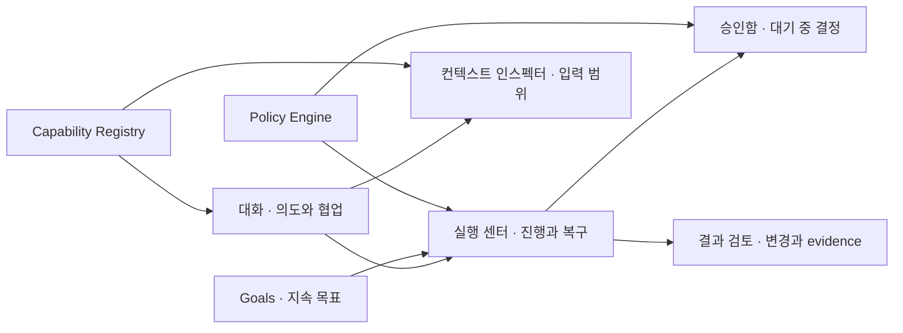

# Code Assistant 기능·사용자 경험 개선 설계

## 문서 목적

이 문서는 현재 구현을 기준으로 사용자가 작업을 시작하고, 진행 상황을 이해하고, 결과를 검토하고, 중단된 실행을 복구하는 전 과정을 개선하기 위한 제품 설계다. 아이디어를 화면에 직접 고정하지 않고 runtime capability, workspace 상태, 정책과 실행 evidence를 조합해 다음 행동을 동적으로 제시하는 것을 원칙으로 한다.

보안 결정은 LLM에 위임하지 않는다. Trust, approval, revision, workspace containment 같은 허용 여부는 기존 결정론적 정책이 판단하고, LLM은 허용된 capability 안에서 의도 분류, 설명, 다음 행동 후보와 성공 기준 초안을 생성한다.

## 구현 상태

2026-07-14 기준으로 0단계 계약의 첫 범위와 1단계 시작 허브를 구현했다.

- shared `ReadinessSnapshot`, `ReadinessItem`, `ActionDescriptor` 계약
- 공급자, 모델, workspace, Trust 의존성을 정규화하는 순수 resolver
- main bootstrap의 authoritative readiness snapshot
- renderer 상태 변경 시 같은 resolver로 즉시 다시 계산되는 적응형 시작 허브
- 완료 항목은 진행률로 접고 현재 필요한 한 단계만 노출하는 간결한 시작 허브
- 가능한 행동만 우선순위로 노출하고 composer focus까지 연결하는 host action
- 한국어·영어, keyboard focus와 Electron E2E 검증

아직 구현하지 않은 범위는 컨텍스트 인스펙터, evidence 기반 결과 검토, durable 실행 센터·승인함과 Goal verifier다. 아래 구현 순서는 이 상태를 기준으로 유지한다.

## 현재 제품 진단

### 잘 갖춰진 기반

- 대화와 Goal이 같은 실행 코어, driver, 도구 정책과 run journal을 사용한다.
- Workspace Trust, exact approval, mutation journal, undo와 민감 정보 차단 경계가 명확하다.
- tool activity, 변경 경로, token 사용량, 중단 상태를 대화 안에서 확인할 수 있다.
- 대화 기록, Goal plan/checkpoint, Git 상태·diff, Skill과 MCP 확장 지점이 이미 존재한다.
- 한국어와 영어, 키보드 포커스, 반응형 패널을 지원한다.

### 주요 경험 단절

| 사용자 질문 | 현재 경험의 단절 | 제품 영향 |
| --- | --- | --- |
| 무엇부터 해야 하나? | 공급자, 모델, 폴더, Trust가 별도 화면과 배너에 흩어져 있다. | 첫 성공까지 시행착오가 생긴다. |
| 지금 무엇을 하고 있나? | 실행 상태가 현재 assistant message의 tool activity에 종속된다. | 긴 작업과 여러 Goal의 상태를 비교하기 어렵다. |
| 왜 멈췄나? | 승인 모달, toast, 중단 메시지가 각각 순간 상태를 설명한다. | 앱 재접속이나 문맥 전환 뒤 다음 행동이 불명확하다. |
| 무엇이 실제로 바뀌었나? | 변경 경로는 보이지만 diff, 검증, 위험, undo는 서로 다른 진입점에 있다. | 완료 판단과 리뷰 비용이 커진다. |
| 어떤 컨텍스트가 모델에 전달되나? | 첨부 파일 chip은 보이지만 지침, Skill, 도구 결과와 token 영향은 통합되지 않는다. | 과다·누락 컨텍스트를 사용자가 통제하기 어렵다. |
| Goal이 얼마나 진척됐나? | plan과 checkpoint는 있으나 evidence와 성공 기준이 구조화되지 않았다. | 모델의 완료 주장과 실제 완료를 비교하기 어렵다. |

## 제품 원칙

1. **상태에서 행동으로 연결한다.** 모든 empty, blocked, interrupted 상태는 원인과 실행 가능한 다음 행동을 함께 제공한다.
2. **대화와 실행을 분리한다.** 대화는 의도와 협업의 공간이고, 실행 센터는 실행·승인·복구의 지속 상태를 담당한다.
3. **완료를 evidence로 설명한다.** 답변 길이가 아니라 변경, 검증, 실패, 미해결 위험으로 결과를 구성한다.
4. **권한과 추천을 분리한다.** 정책 엔진이 가능한 행동을 확정하고 LLM은 그 범위에서 의미 있는 후보를 제안한다.
5. **동적 capability를 UI의 원천으로 사용한다.** 명령, Skill, MCP, driver와 향후 Hook을 action registry로 통합해 화면별 하드코딩을 피한다.
6. **점진적으로 공개한다.** 첫 화면에는 다음 행동과 핵심 위험을, 상세 화면에는 revision, hash, raw arguments 같은 감사 정보를 둔다.
7. **좌측 accent bar를 사용하지 않는다.** 선택과 상태는 배경, 테두리 전체, chip, icon과 타이포그래피로 표현한다.

## 목표 정보 구조



상단 앱바에는 새 대화, 전역 검색, 실행 상태, Goals, 설정을 둔다. 실행 중이거나 승인이 대기 중이면 실행 상태에 숫자 badge와 가장 높은 우선순위 상태를 표시한다. 파일 탐색기와 미리보기는 현재처럼 필요할 때 여는 작업 패널로 유지한다.

## 우선 설계 1: 적응형 시작 허브

### 목적

첫 실행과 워크스페이스 전환 뒤 사용자가 다음 준비 단계를 추측하지 않도록 한다.

### 경험

대화 empty state를 정적인 환영 화면이 아니라 `ReadinessSnapshot` 기반 시작 허브로 바꾼다. 다음 준비 항목은 고정 순서가 아니라 의존 관계와 현재 상태에서 계산한다.

- 공급자 연결 및 모델 사용 가능 여부
- 워크스페이스 선택 여부
- Workspace Trust 상태와 제한되는 기능
- 선택 모델의 tool/structured output capability
- 발견된 저장소 지침, Skill, MCP와 위험 요약

`NextActionResolver`는 정책이 허용한 `ActionDescriptor` 중 즉시 수행 가능한 행동을 우선 정렬한다. LLM은 사용자의 최근 의도와 저장소 요약을 바탕으로 “테스트 추가”, “구조 설명”, “변경 검토” 같은 시작 제안을 생성할 수 있지만, 존재하지 않는 명령이나 허용되지 않은 효과를 제안할 수 없다.

### 화면 구성

- 상단: 현재 준비 상태를 한 문장으로 요약
- 중앙: 완료 항목은 `완료 수/전체 수`로 접고 현재 필요한 한 단계만 표시
- 하단: 가장 적절한 기본 행동 하나와 보조 행동 최대 두 개
- 상세: 공급자와 저장소에 전송될 수 있는 데이터 범위

empty 화면에서는 같은 Trust 상태를 반복하는 전역 배너를 숨기고 시작 허브를 단일 진입점으로 사용한다. 대화가 시작되면 전역 Trust 배너를 다시 표시해 실행 중 보안 상태가 사라지지 않게 한다.

성공 기준은 신규 사용자가 README를 열지 않고도 첫 유효 응답 또는 첫 검증된 변경에 도달하는 것이다.

## 우선 설계 2: 영속 실행 센터와 승인함

### 목적

현재 대화에 종속된 단일 foreground run을 여러 대화와 Goal의 영속 실행 상태로 확장하고, 중단·승인·재시작을 한곳에서 다룬다.

### 실행 카드

각 실행은 다음 정보를 같은 카드에 표시한다.

- 동적으로 생성된 작업 제목과 원래 요청
- `queued`, `running`, `awaiting_approval`, `verifying`, `interrupted`, `failed`, `completed` 상태
- 현재 단계, 최근 tool activity와 경과 시간
- workspace, conversation/Goal, model과 policy profile
- token/time/tool-call budget과 사용량
- 변경 파일 수, 검증 수, 경고 수
- 가능한 다음 행동: 보기, 승인 검토, 취소, 재개, 결과 검토

상태 문자열은 UI에서 임의 조합하지 않는다. main process가 안정적인 `statusCode`, `reasonCode`, `availableActions`와 진행 snapshot을 제공하고 renderer는 locale별 표현을 담당한다.

### 승인함

승인은 차단 모달만 제공하지 않고 영속 승인함에도 기록한다. 각 항목은 효과, 대상, 위험, revision, 만료, 요청한 실행을 보여준다. 기본 화면은 “무엇이 왜 필요한가”를 설명하고, 상세 화면에서 exact diff, argv, cwd, network, action hash를 확인한다.

정확 승인과 향후 scoped grant는 명확히 구분한다. grant 제안은 반복 승인 패턴을 분석해 만들 수 있으나, 실제 범위와 허용 여부는 정책 schema와 사용자의 명시적 선택으로 확정한다.

### 복구

- renderer reload 뒤 event cursor로 실행과 pending approval을 복원한다.
- interrupted 실행은 `마지막 checkpoint에서 계속`, `현재 변경만 검토`, `종료`를 제공한다.
- stale workspace/tool/provider revision은 자동 재실행하지 않고 변경 내용을 비교한 뒤 새 검토를 요구한다.
- 여러 실행은 workspace lease와 Goal reservation 상태를 보여주며 충돌 이유를 설명한다.

이 설계는 `ExecutionRequest` queue, attempt lease, ordered event와 persistent approval이 구현된 뒤 활성화한다. UI만 먼저 만들어 foreground 상태를 영속 실행처럼 오인시키지 않는다.

## 우선 설계 3: 결과 검토

### 목적

assistant 답변과 실제 작업 결과를 분리해 사용자가 완료 여부를 빠르게 판단하게 한다.

### 결과 모델

```ts
interface RunOutcomeView {
  summary: string
  effects: EffectEvidence[]
  verifications: VerificationEvidence[]
  unresolvedRisks: RiskEvidence[]
  changedPaths: ChangedPathSummary[]
  availableActions: ActionDescriptor[]
}
```

`EffectEvidence`와 `VerificationEvidence`는 모델 자유 서술만 저장하지 않는다. host가 관찰한 tool receipt, mutation journal, command exit code, Git diff와 Goal revision을 근거로 만들고 모델은 이를 읽기 쉬운 설명으로 요약한다.

### 화면 구성

- 요약: 달성한 목적과 남은 문제
- 변경: 파일별 목적, additions/deletions, diff 열기
- 검증: 실행한 검사, 결과, 소요 시간, 실패 상세
- 위험: 미검증 영역, 부분 적용, 외부 효과 불확실성
- 행동: 대화에서 수정 요청, 변경 되돌리기, 후속 Goal 만들기, diff 내보내기

성공 결과에만 초록색을 사용하고, “응답 생성 완료”와 “작업 검증 완료”를 같은 상태로 표현하지 않는다. 부분 적용 또는 검증 실패는 결과 검토를 자동으로 열되 사용자의 편집 문맥을 가리지 않는 non-modal 방식으로 표시한다.

## 우선 설계 4: 컨텍스트 인스펙터

### 목적

사용자가 모델에 들어가는 정보의 출처, 범위와 비용을 이해하고 조절하게 한다.

### 컨텍스트 구성

- 사용자가 명시적으로 첨부한 파일과 선택 범위
- 현재 대화 요약과 Goal objective/plan/checkpoint
- 적용되는 `AGENTS.md`, 구성된 추가 지침 소스와 Skill instruction
- tool이 실행 중 읽은 파일과 생성한 bounded result
- 활성 MCP capability와 공급자에 전달될 수 있는 데이터 유형

각 항목은 `source`, `revision`, `reason`, `sensitivity`, `estimatedTokens`, `removable`을 가진다. token은 provider tokenizer가 있으면 이를 사용하고, 없으면 명확히 “추정”으로 표시한다.

LLM 기반 `ContextPlanner`는 요청별 관련 파일 후보와 제외 이유를 제안한다. 실제 파일 접근은 Trust와 workspace containment를 통과하고, 자동 제외는 사용자가 고정한 항목을 제거하지 않는다. 컨텍스트가 stale이면 새 revision을 읽거나 기존 snapshot을 유지할지 선택하게 한다.

## 우선 설계 5: Goal 성공 기준과 evidence timeline

### Goal 생성

긴 objective textarea와 token budget만 받는 방식에서 다음 세 단계로 확장한다.

1. 사용자가 자연어 objective를 입력한다.
2. LLM이 현재 저장소를 read-only로 조사해 성공 기준, 단계, 예상 위험과 필요한 capability 초안을 만든다.
3. 사용자가 기준과 실행 정책을 검토해 Goal을 생성한다.

성공 기준은 사용자 문장을 특정 프로젝트 규칙으로 하드코딩하지 않고 `VerifierDescriptor`로 표현한다. 예를 들어 테스트, 빌드, diff 제약, 외부 MCP 조회 등 현재 발견된 verifier를 조합한다.

### Goal 상세

기존 plan과 checkpoint를 시간순 evidence timeline으로 통합한다.

- objective/plan revision 변경
- run 시작·중단·완료
- 변경 effect와 verification evidence
- 승인과 정책 변경
- blocker와 사용자가 내려야 하는 결정

상단에는 상태보다 “다음 결정”을 먼저 표시한다. evidence가 부족하면 모델이 완료를 주장해도 Goal은 `verification_required`로 남는다.

스케줄, retry, background 실행은 durable queue와 scoped grant가 준비되기 전에는 노출하지 않는다. 준비된 뒤에도 최초 기본값은 수동 실행이다.

## 추가 기능 후보

| 우선순위 | 기능 | 사용자 가치 | 선행 조건 |
| --- | --- | --- | --- |
| P1 | 전역 action search | 명령, Skill, 설정과 실행을 한 검색창에서 발견 | Action/Capability Registry |
| P1 | 실패 진단과 안전 재시도 | 원인·부분 효과·재시도 범위를 함께 이해 | structured reason/evidence |
| P1 | 변경 리뷰 comment | 파일/line 단위로 후속 수정 의도를 전달 | 결과 검토, diff model |
| P2 | assistant profile | 모델·도구·지침·정책 조합을 용도별 재사용 | capability negotiation |
| P2 | Goal schedule/retry | 장기 작업을 직접 다시 누르지 않고 지속 | durable queue, grant, scheduler |
| P2 | worktree 격리 | 여러 작업의 파일 충돌과 미완성 변경 격리 | execution backend abstraction |
| P2 | 완료·승인 알림 | 앱을 보고 있지 않아도 필요한 결정 인지 | persistent event/notification policy |
| P3 | 팀 공유용 실행 리포트 | 변경과 evidence를 비밀값 없이 공유 | redacted outcome exporter |

## 동적 설계를 위한 핵심 계약

### ActionDescriptor

```ts
interface ActionDescriptor {
  id: string
  source: 'host' | 'command' | 'skill' | 'mcp' | 'driver'
  labelKey?: string
  generatedLabel?: string
  effects: Array<'read' | 'write' | 'process' | 'network'>
  availability: 'available' | 'blocked' | 'hidden'
  reasonCode?: string
  inputSchema: JsonSchema
  revision: string
}
```

host 기본 행동은 locale key를 사용하고, 동적으로 발견된 행동은 신뢰 가능한 metadata 또는 제한된 LLM 설명을 사용한다. 동일한 descriptor를 시작 허브, slash palette, 전역 검색, 결과 화면에서 재사용한다.

### ReadinessSnapshot과 RunSnapshot

renderer가 서비스별 boolean을 재해석하지 않도록 main이 snapshot을 조립한다. snapshot에는 `availableActions`가 포함되며 UI는 상태에 맞는 행동만 렌더링한다. 이 방식은 공급자와 도구가 추가돼도 화면 분기를 계속 늘리지 않게 한다.

### Evidence

```ts
interface Evidence {
  id: string
  kind: 'effect' | 'verification' | 'receipt' | 'decision'
  source: string
  observedAt: string
  revision?: string
  status: 'passed' | 'failed' | 'uncertain'
  summary: string
  detailsRef?: string
}
```

`summary`는 LLM이 생성할 수 있지만 `status`, source receipt와 revision은 host 관찰로 확정한다. 외부 MCP 효과의 응답이 유실되면 `uncertain`으로 남기고 reconciliation 전 자동 재호출하지 않는다.

## 상태별 UX 규칙

| 상태 | 기본 메시지 | 기본 행동 |
| --- | --- | --- |
| 준비 미완료 | 누락된 의존성과 영향 | 다음 준비 단계 열기 |
| 실행 중 | 현재 단계와 최근 evidence | 실행 센터 보기, 취소 |
| 승인 대기 | 요청 효과와 대기 시간 | 승인함에서 검토 |
| 중단 | 확인된 효과와 중단 원인 | checkpoint에서 계속 |
| 실패 | 실패 범위와 적용 여부 | 안전 재시도 또는 결과 검토 |
| 완료·미검증 | 작업 효과와 부족한 evidence | 검증 실행 |
| 완료·검증됨 | 달성 결과와 후속 위험 | 결과 검토 |

모든 상태는 색상만으로 구분하지 않고 icon, label과 설명을 함께 사용한다. toast는 보조 알림으로만 사용하며 사용자가 반드시 처리해야 하는 상태를 toast에만 두지 않는다.

## 접근성·반응형·시각 원칙

- 실행 상태와 승인 badge는 screen reader용 전체 문구를 제공하고 변화는 과도하지 않은 live region으로 알린다.
- modal을 닫은 뒤 focus를 원래 trigger에 복원하고, 실행 센터의 drawer와 결과 패널도 동일한 focus contract를 사용한다.
- 900px 이하에서는 파일 패널과 실행 센터를 겹치는 drawer로 제공하되 composer와 실행 취소는 항상 접근 가능하게 한다.
- 긴 diff와 로그는 가상화하고 검색, 줄바꿈, 복사와 파일 열기를 제공한다.
- 선택 상태는 전체 배경/테두리, icon과 `aria-current`로 표현하며 좌측 accent bar를 사용하지 않는다.
- 위험 색상은 승인 필요 여부가 아니라 실제 효과와 불확실성을 표현한다. 반복되는 일반 승인을 모두 위험색으로 칠하지 않는다.

## 측정 지표

개인정보를 침해하지 않는 로컬 집계 또는 명시적 opt-in telemetry를 전제로 한다.

- 첫 유효 응답/검증된 변경까지 걸린 시간
- 준비 단계에서 이탈하거나 같은 화면을 반복 방문한 비율
- 실행 중 사용자가 상태를 확인하기 위해 연 모달/명령 수
- 승인 요청의 거절, 만료, 반복 승인 비율
- interrupted run의 성공적 재개율과 중복 효과 차단율
- 완료 후 diff/검증 확인률과 undo 비율
- 컨텍스트 stale 경고와 과도한 token 사용 감소율
- Goal의 evidence 충족 완료율과 수동 재개 횟수

## 구현 순서

### 0단계: 계약과 관측성

- `ActionDescriptor`와 `ReadinessSnapshot`의 시작 준비 범위는 구현했다. 다음으로 `Evidence`와 structured run reason code를 정의한다.
- 기존 tool activity, mutation journal, run usage, Goal checkpoint를 evidence adapter로 감싼다.
- 상태 전이와 사용자 행동을 비밀값 없이 로컬에서 측정할 수 있게 한다.

### 1단계: 현재 구조에서 즉시 개선

- 적응형 시작 허브는 구현했다. 다음으로 컨텍스트 인스펙터를 추가한다.
- run 종료 뒤 결과 검토를 제공하고 Git diff, 검증, undo 진입점을 통합한다.
- slash command와 상단 기능을 같은 action registry에 연결한다.

### 2단계: durable 실행 기반

- `ExecutionRequest` queue, lease, ordered event, persistent approval을 구현한다.
- renderer를 multi-run store로 전환하고 실행 센터와 승인함을 연다.
- reload, stale revision, interrupted attempt와 idempotent recovery를 검증한다.

### 3단계: Goal 자율성

- 구조화 성공 기준과 verifier evidence를 Goal에 연결한다.
- scoped grant 후 schedule/retry provider를 추가한다.
- worktree/container backend와 결과 반입 검토를 추가한다.

### 4단계: 확장 조립

- assistant profile과 capability negotiation을 제공한다.
- Subagent, Hook, MCP resource/prompt를 같은 registry와 evidence 흐름에 연결한다.

## 검증 계획

### 사용성 시나리오

1. 설정이 없는 신규 사용자가 공급자, 모델, 폴더와 Trust를 완료하고 첫 작업을 수행한다.
2. 사용자가 파일을 첨부하고 실제 전송 컨텍스트와 token 영향을 확인한다.
3. 파일 변경과 command 승인이 섞인 실행에서 승인 이유와 결과를 설명한다.
4. 앱 reload 뒤 실행과 승인 상태를 복원하고 중복 효과 없이 계속한다.
5. 검증 실패 후 결과 검토에서 실패 원인을 보고 수정 대화를 시작한다.
6. Goal이 성공 기준을 충족하지 못했을 때 완료 대신 필요한 verifier를 제안한다.

### 자동화

- snapshot/action/evidence schema의 strict validation과 migration test
- policy가 숨긴 action을 LLM 추천이 다시 노출하지 못하는 contract test
- event cursor 재접속과 approval idempotency test
- 결과 검토의 effect/verification/uncertain 상태 E2E
- keyboard-only, focus restoration, screen reader label과 좁은 viewport E2E
- 한국어/영어 reason code 번역 누락 검사

## 결정 사항과 비범위

- 제품의 다음 큰 단위는 새로운 업무별 버튼 추가가 아니라 실행 가시성, 결과 evidence와 동적 action registry다.
- background Goal은 durable queue와 scoped grant 이전에는 구현하거나 암시하지 않는다.
- LLM 추천이 Trust나 approval을 우회하지 않는다.
- 현재 단계에서는 실시간 협업, 클라우드 동기화, marketplace와 조직 관리자 기능을 범위에 포함하지 않는다.
- 본 문서는 설계 산출물이며 실제 UI와 데이터 계약 구현은 위 단계별로 별도 검증한다.
